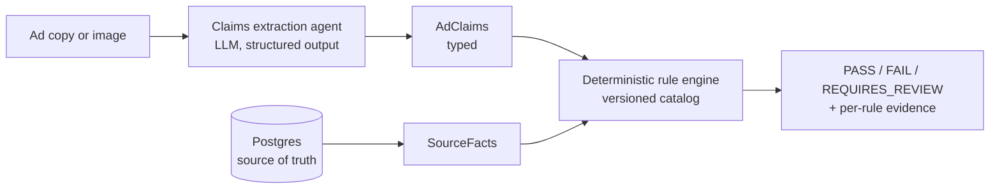

# AutoAd Compliance AI Engine

> A production-grade AI pipeline that **generates** automotive dealership ad copy
> from inventory data and **validates** any ad against state / OEM / FTC
> compliance rules — **blocking non-compliant outputs before they ship** through
> deterministic rule checks, automated evals, and human-in-the-loop review.

Automotive advertising is one of the most heavily regulated categories of
consumer marketing in the US. A single ad that quotes a lease payment without the
required disclosures, or shows a price that doesn't match the actual vehicle, can
trigger FTC action, state enforcement, or an OEM pulling co-op ad funds. Dealer
groups produce thousands of ads a month — far too many to review by hand.

AutoAd sits between *"generate the ad"* and *"publish the ad."* It returns one of
`PASS` / `FAIL` / `REQUIRES_REVIEW` with the exact rules implicated and the
evidence behind each finding. Non-compliant assets are blocked; ambiguous ones
route to a reviewer with a full audit trail.

> **Not legal advice.** This system encodes a curated approximation of advertising
> rules to assist a compliance team; it does not replace legal review. Human
> approval and `REQUIRES_REVIEW` are first-class features.

---

## The one architectural decision that matters

**The LLM never produces the final compliance verdict.**

The LLM *extracts structured claims* from unstructured ad content into a typed
`AdClaims` object. A *deterministic rule engine* — pure functions, fully
unit-tested — produces the verdict by comparing those claims against
authoritative inventory/offer data. The verdict is **code, not generation**, so a
hallucinated price or a missed disclosure can never become a confident `PASS`.



Subjective checks (brand voice/tone) may use an LLM-as-judge, but it can only
contribute a *signal* — it can never override a deterministic `blocker`.

### Verdict logic
- Any unresolved `blocker` ⇒ `FAIL`
- No blockers, but a `warning` **or** low-confidence extraction ⇒ `REQUIRES_REVIEW`
- Clean ⇒ `PASS`

### Recall over precision (a deliberate tradeoff)
Missing a real violation (false negative) is the costly error; a false positive
merely routes an ad to a human. So the system is tuned for **high recall on
blocker violations** and favors `REQUIRES_REVIEW` over a risky `PASS`.

---

## Quickstart

Requires [uv](https://docs.astral.sh/uv/) and Docker.

```bash
# 1. Install dependencies (application project; uv manages the venv)
uv sync --extra dev

# 2. Start Postgres and apply migrations
docker compose up -d
uv run alembic upgrade head

# 3. Seed synthetic inventory (deterministic)
uv run python -m scripts.seed

# 4. Configure your key
cp .env.example .env   # then set ANTHROPIC_API_KEY

# 5. Run the API
uv run uvicorn app.main:app --reload
```

Validate an ad:

```bash
curl -s localhost:8000/validate -H 'content-type: application/json' -d '{
  "vehicle_id": 1,
  "copy_text": "Drive home the Honda Civic Touring for just $249/mo!"
}' | jq
```

The seeded Civic is a **Sport** with no advertised lease disclosures, so this
returns `FAIL` on `ADVERTISED_TRIM_MATCHES_SOURCE` (trim mismatch) and
`LEASE_DISCLOSURE_REQUIRED` (missing Regulation M trigger-term disclosures) —
with the extracted claims and evidence attached.

### Endpoints

| Method | Path | Purpose |
|---|---|---|
| `POST` | `/validate` | Validate ad copy for a vehicle → verdict + violations |
| `GET` | `/reviews?status=REQUIRES_REVIEW` | The review queue |
| `GET` | `/runs/{id}` | Full audit detail for one compliance run |
| `POST` | `/runs/{id}/decisions` | Log a reviewer decision (approve/reject/override) |
| `GET` | `/ruleset/active` | The active ruleset and its rules (catalog view) |

Every run is pinned to an immutable `ruleset_version`, and reviewer decisions
are appended to the audit trail — the deterministic verdict itself is never
mutated, so overrides are logged, never silent.

---

## Testing & evals

```bash
uv run pytest                          # deterministic suite — fast, no API calls
uv run pytest evals/deepeval --no-cov  # live eval (uses ANTHROPIC_API_KEY)
```

Three independently testable surfaces:

| Surface | Tooling | What it proves |
|---|---|---|
| **Rule-logic correctness** | `pytest` (pure functions) | Every predicate + rule fixture; deterministic, always green |
| **Extraction quality** | DeepEval | Recall on trigger-term detection (the dangerous miss) |
| **Generation faithfulness** | DeepEval + field-match | Zero hallucinated facts in generated copy *(Phase 2)* |

---

## Project layout

```
app/
  api/         FastAPI routes (thin HTTP layer)
  models/      Pydantic + SQLAlchemy models (AdClaims lives here)
  rules/       deterministic rule engine + predicate library + catalog loader
  llm/         Pydantic AI agents (extraction; generation/judge later)
  validation/  orchestration: extract -> evaluate -> verdict
  generation/  copy gen + HTML rendering (Phase 2)
  vision/      image extraction (Phase 3)
rules/         rule catalog as YAML (authoring source)
evals/         golden datasets + DeepEval suites
tests/         pytest — deterministic rule logic, always green
scripts/       synthetic inventory/offer seeder
infra/         Terraform (Phase 4)
```

See [`CLAUDE.md`](CLAUDE.md) for architecture principles and conventions, and
[`autoad-compliance-ai-engine-spec.md`](autoad-compliance-ai-engine-spec.md) for
the full scope and roadmap.

---

## Status

| Phase | Scope | State |
|---|---|---|
| **0** | Vertical slice: data foundation, `AdClaims`, rule engine, extraction, `POST /validate` | ✅ Done |
| **1** | Rules as versioned DB rows + `ruleset_version` pinning, 12-rule catalog (federal + CA + OEM), audit trail + review-queue API | ✅ Done |
| **2** | Copy generation + the eval hero + CI gate | 🚧 Next |
| **3** | Multimodal validation (HTML render + vision extraction) | ⬜ Planned |
| **4** | Production on AWS (Docker, Terraform, async pipeline) | ⬜ Planned |

**Tech:** Python 3.12 · FastAPI · Pydantic AI · Pydantic v2 · PostgreSQL +
SQLAlchemy 2.0 + Alembic · DeepEval · Docker.
