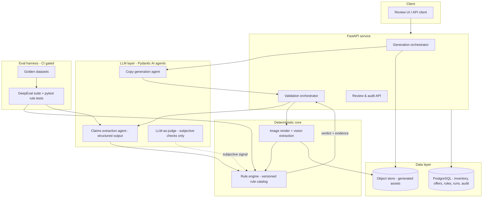
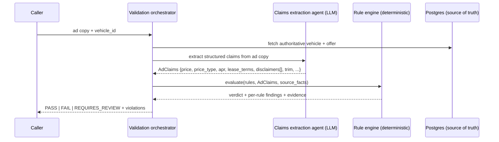

# AutoAd Compliance AI Engine — Project Scope & Build Spec

> A production-grade AI pipeline that generates automotive dealership ad copy and creative from vehicle inventory data, validates every asset against state/OEM/dealer compliance rules, and **blocks non-compliant outputs before they ship** through deterministic rule checks, automated evals, and human-in-the-loop review.

**Document type:** Product/engineering scoping doc, written to be handed to Claude Code as the source of truth.
**Status:** v1 scope locked. Phase 2 items explicitly deferred.

---

## 0. How to read this document

This is the spec a consultant would hand a delivery team. It defines *what* we're building, *why*, the *architecture*, the *data model*, and a *build-first roadmap* where every phase ends in something demoable. Section 13 is written specifically for driving Claude Code (repo layout, `CLAUDE.md` contents, prompt sequencing).

**One architectural decision underpins everything (read this even if you skim the rest):** the LLM never produces the final compliance verdict. The LLM *extracts structured claims* from unstructured ad content; a *deterministic rule engine* produces the verdict. This is what makes the system trustworthy, testable, and auditable — and it's the answer to the question every interviewer for this role will ask: "how do you stop the AI from hallucinating a price or a missing disclaimer?"

---

## 1. Executive summary

Automotive advertising is one of the most heavily regulated categories of consumer marketing in the US. A single ad that states a lease payment without the required disclosures, or shows a price that doesn't match the actual vehicle, can trigger FTC action, state attorney-general enforcement, or an OEM yanking co-op advertising funds. Dealer groups generate thousands of ads a month across Google, Meta, display, and email — far too many to review by hand.

**AutoAd Compliance AI Engine** is the system that sits between "generate the ad" and "publish the ad." It can both *generate* compliant creative from inventory data and *validate* any ad (human- or AI-made) against a versioned rule catalog, returning one of `PASS`, `FAIL`, or `REQUIRES_REVIEW` with the exact rules implicated and the evidence behind each finding. Non-compliant assets are blocked; ambiguous ones are routed to a human reviewer with a full audit trail.

The engineering centerpiece — and the portfolio differentiator — is the **evaluation harness**: an automated, CI-gated suite that proves the system catches real violations and that AI-generated copy stays faithful to source data. The demo climax is a generated ad that *looks* perfect, which the eval pipeline blocks because the APR disclosure is missing and the advertised trim doesn't match inventory.

---

## 2. Problem & domain context

Why this is genuinely hard (and why solving it is impressive):

- **The rules are real law, not style preferences.** Finance advertising is governed by the Truth in Lending Act (implemented by Regulation Z); lease advertising by the Consumer Leasing Act (Regulation M); and deceptive advertising generally by Section 5 of the FTC Act. Reg Z and Reg M use the concept of *trigger terms* — stating something like a down payment amount, monthly payment, or number of payments obligates the ad to include a defined set of additional disclosures.
- **Rules stack by jurisdiction.** Federal baseline, plus state-specific requirements (California, for example, adds its own), plus OEM co-op advertising guidelines (approved offer language, logo/font usage, disclaimer placement). The same ad can be compliant in one state and not another.
- **The facts must match reality.** The advertised price, trim, APR, term, and expiration must match the actual vehicle and offer. This is exactly where naive AI generation fails — it confidently invents plausible numbers.
- **Volume defeats manual review.** The value is in automation that is *trustworthy enough to block*, not just flag.

> **Not legal advice.** This system encodes a curated approximation of advertising rules to assist a compliance team; it does not replace legal review. `REQUIRES_REVIEW` and human approval are first-class features precisely because the system augments humans rather than replacing them. The rule catalog cites its sources but is maintained by the product, not warranted as legal counsel.

---

## 3. Goals & non-goals

**Goals (v1)**
- Validate arbitrary ad copy (and, by Phase 3, ad images) against a versioned rule catalog and return `PASS` / `FAIL` / `REQUIRES_REVIEW` with per-rule evidence.
- Generate compliant ad copy from structured vehicle/offer data.
- Maintain a full audit trail: what was checked, against which ruleset version, by which model versions, and who approved/overrode.
- Ship an automated, CI-gated eval suite that blocks regressions in violation-detection quality and generation faithfulness.
- Deploy as a real production-style service on AWS.

**Non-goals (explicitly out of scope for v1 — see §16)**
- Video generation. (Image + OCR validation is in; video is deferred.)
- Publishing to live ad platforms (Google Ads / Meta) via their APIs. We model the creative hierarchy conceptually; we don't push live.
- Training or hosting custom models / drift monitoring infra (SageMaker). We call hosted frontier models via API.
- Being a system of record for legal authority. We assist; we don't certify.
- Multi-tenant SaaS hardening, billing, SSO. (Single-org assumption for v1.)

---

## 4. Users & personas

| Persona | Goal | What they touch |
|---|---|---|
| **Marketing ops** (dealer group) | Produce lots of on-brand, compliant ads fast | Generation endpoints, sees PASS/FAIL feedback |
| **Compliance reviewer** | Catch what automation can't decide; sign off | Review queue, audit trail, override |
| **OEM brand manager** | Ensure brand/offer rules are honored | Rule catalog (OEM rules), reports |
| **The demo audience** (hiring panel) | See that this person can ship trustworthy production AI | The eval-blocks-a-bad-ad moment, the live system, the README |

The last row is real: the system is also a portfolio artifact, and design choices should serve the demo narrative, not just the architecture.

---

## 5. Core use cases / flows

**UC-1 — Validate existing ad copy.** Input: ad copy + `vehicle_id`. Output: verdict + violations + evidence. *(This is the thin vertical slice built first.)*

**UC-2 — Generate compliant ad copy.** Input: `vehicle_id` + channel + offer. Output: generated copy that is auto-validated before it's returned; if it fails, the system can self-correct and re-validate.

**UC-3 — Generate + validate an ad image (the multimodal money shot).** Input: `vehicle_id` + template. Output: rendered ad image; the system extracts the *displayed* price/trim/disclaimer and cross-checks them against source data. Catches "the picture says $299/mo but the offer is $399/mo."

**UC-4 — Human review & audit.** `REQUIRES_REVIEW` assets land in a queue; a reviewer approves/rejects/overrides; every decision is logged with reasons and timestamps.

---

## 6. System architecture

The system is a small set of services around one principle: **fuzzy extraction in, deterministic judgment out.**



**Components**
- **FastAPI service** — thin HTTP layer; orchestrates generation, validation, and review.
- **LLM layer (Pydantic AI)** — agents with typed, structured outputs: a *generation* agent, a *claims-extraction* agent, and an optional *LLM-as-judge* used only for subjective checks (brand voice/tone), never for numeric or legal facts.
- **Deterministic core** — the rule engine evaluates a versioned catalog against extracted claims + source data and emits the verdict. The image path renders creative and uses a vision model to extract *displayed* values, which feed the same rule engine.
- **Data layer** — PostgreSQL for inventory, offers, rules, runs, and audit; object storage for generated assets.
- **Eval harness** — `pytest` for the deterministic rule logic plus DeepEval for extraction/generation quality, run as a CI gate.

---

## 7. The extraction-then-deterministic pattern (the crown jewel)

This is the most important section. The flow for validating any ad:



Why this matters:
1. **The LLM does what it's good at** — turning messy free-text (or a rendered image) into a typed `AdClaims` object.
2. **The rule engine does what must be reliable** — comparing claimed price to source price, checking that a monthly-payment ad includes the required lease disclosures, etc. These are pure functions: deterministic, unit-testable, and auditable. No hallucinated verdicts are possible because the verdict is code, not generation.
3. **Subjective checks are quarantined.** Tone/brand-voice can use an LLM-as-judge, but it can only ever *contribute a signal*; it can never override a deterministic blocker.
4. **It makes evaluation tractable** by splitting three independently testable surfaces: extraction quality, rule-logic correctness, and generation faithfulness (see §10).

This pattern is also the conceptual cousin of decision-intelligence work — encode the rules as a canonical, versioned model; let data/LLM connectivity be the delivery mechanism, not the source of truth.

---

## 8. Data model

PostgreSQL. Use JSONB for flexible fields (rule predicates, extracted claims, evidence). Use Alembic for migrations from day one.

| Entity | Key fields | Notes |
|---|---|---|
| `oem` | id, name, brand_guidelines_ref | Brand/co-op rules attach here |
| `dealership` | id, name, dba_name, oem_id, jurisdiction (state/country) | Jurisdiction drives applicable rules |
| `vehicle` | id, dealership_id, vin, year, make, model, **trim**, **msrp**, **dealer_price**, mileage, condition, stock_number, body_style | The source of truth for factual checks |
| `offer` | id, vehicle_id (or scope), type (`lease`/`finance`/`cash`/`rebate`), apr, term_months, monthly_payment, down_payment, due_at_signing, residual, expiration_date, jurisdiction | What an ad is allowed to claim |
| `rule` | id, rule_key, **version**, jurisdiction, applies_when (JSONB), requirement (JSONB), severity (`blocker`/`warning`/`info`), description, remediation, effective_from, effective_to, source_citation | Versioned & jurisdiction-scoped |
| `ruleset_version` | id, label, created_at, rule_ids[] | Pin a run to an immutable ruleset |
| `ad_asset` | id, vehicle_id, channel (`google`/`meta`/`display`/`email`), format (`text`/`image`/`html`), generated_by, copy_text, image_s3_key, generation_metadata (JSONB), created_at | Human- or AI-authored |
| `compliance_run` | id, ad_asset_id, ruleset_version_id, status (`PASS`/`FAIL`/`REQUIRES_REVIEW`), extracted_claims (JSONB), model_versions (JSONB), started_at, completed_at | Immutable record of one evaluation |
| `violation` | id, compliance_run_id, rule_id, severity, message, evidence (JSONB) | Evidence = which claim + which source fact |
| `review_decision` | id, compliance_run_id, reviewer, decision (`approve`/`reject`/`override`), notes, decided_at | Audit trail; overrides are logged, never silent |

**Verdict logic (deterministic):** any unresolved `blocker` ⇒ `FAIL`; no blockers but one or more `warning`/ambiguous-extraction conditions ⇒ `REQUIRES_REVIEW`; clean ⇒ `PASS`.

---

## 9. Rules engine & rule schema

The rule catalog is the durable IP. Rules are data, not code, so the catalog can grow without redeploys and changes are versioned and diffable.

**Rule schema (YAML; stored as rows, authored as files in `/rules`):**

```yaml
- rule_key: LEASE_DISCLOSURE_REQUIRED
  version: 1
  jurisdiction: US                # federal baseline (Reg M / CLA)
  severity: blocker
  description: >
    If an ad advertises a monthly lease payment, it must disclose the
    required lease terms (Consumer Leasing Act / Regulation M trigger terms).
  applies_when:
    all:
      - claim_present: lease_monthly_payment
  requirement:                    # ALL must be present/true
    all:
      - claim_present: down_payment_or_amount_due_at_signing
      - claim_present: lease_term_months
      - claim_present: total_of_payments_or_apr
      - claim_present: lessee_responsibility_disclaimer
  remediation: "Add due-at-signing, term length, and lessee-responsibility language to the disclosure."
  source_citation: "Consumer Leasing Act; Regulation M (12 CFR 1013) advertising provisions"

- rule_key: ADVERTISED_PRICE_MATCHES_SOURCE
  version: 1
  jurisdiction: US
  severity: blocker
  description: "The advertised price must match the authoritative vehicle/offer price."
  applies_when:
    all:
      - claim_present: advertised_price
  requirement:
    all:
      - claim_equals_source:
          claim: advertised_price
          source: offer.effective_price
          tolerance: 0
  remediation: "Correct the advertised figure to match the source offer, or update the offer."
  source_citation: "FTC Act §5 (deceptive pricing)"
```

**Predicate vocabulary** (deterministic functions the engine implements): `claim_present`, `claim_equals_source`, `claim_within_tolerance`, `disclaimer_contains`, `expiration_in_future`, `all`/`any`/`not` combinators. Keep this vocabulary small and well-tested; breadth comes from *more rules*, not more predicate types.

**Extraction contract (`AdClaims`)** — the typed Pydantic model the extraction agent must populate, e.g.: `advertised_price`, `price_type`, `apr`, `lease_monthly_payment`, `lease_term_months`, `due_at_signing`, `down_payment`, `expiration_date`, `trim_claimed`, `disclaimers: list[str]`, `confidence_notes`. Low extraction confidence is itself a `REQUIRES_REVIEW` trigger — don't let a shaky extraction become a confident PASS.

---

## 10. Evaluation strategy — **the hero of the project**

Treat evals as the climax, not the plumbing. This is the section that wins the role. Three independently testable surfaces:

**A. Rule-logic correctness (deterministic, `pytest`, always in CI).**
The rule engine is pure functions over `(AdClaims, source_facts)`. Cover every predicate and a table of rule fixtures with expected findings. Fast, no LLM, no flakiness.

**B. Extraction quality (DeepEval).**
Golden set of ad-copy samples labeled with their *true* claims. Measure precision/recall on extracted fields. A miss here (e.g., failing to detect a monthly-payment claim) is the dangerous case because it can suppress a real violation — so weight recall on trigger-term detection heavily.

**C. Generation faithfulness (DeepEval + deterministic field-match).**
For generated copy, verify zero hallucinated facts: every number/trim/term in the output must trace to source data. Combine a deterministic field-match with a faithfulness-style metric.

**End-to-end compliance accuracy.** On a golden dataset of ~50–100 labeled ads (compliant + non-compliant with known violations), produce a confusion matrix over `PASS`/`FAIL`/`REQUIRES_REVIEW` and per-rule violation detection.

**Tune for the right error.** Missing a real violation (false negative) is the costly error; a false positive merely routes an ad to human review. So the target metric is **high recall on blocker violations** (aim ≥ 0.95), accepting some false positives that fall through to `REQUIRES_REVIEW`. State this asymmetry explicitly in the README — it reads as product maturity.

**CI gate (the demonstrable artifact).** A GitHub Actions job runs A + B + C on every PR and **fails the build** if blocker-recall regresses below threshold or any generation sample fails faithfulness. A regression snapshot of golden-set results prevents silent drift.

**The demo money shot.** Generate an ad that looks polished; the eval pipeline flags it: APR disclosure missing (`LEASE_DISCLOSURE_REQUIRED`, blocker) and advertised trim ≠ inventory (`ADVERTISED_TRIM_MATCHES_SOURCE`, blocker); CI blocks the merge. Reproducible in under two minutes. That single before/after is the whole pitch.

---

## 11. Tech stack

| Layer | Choice | Rationale |
|---|---|---|
| Language | Python 3.12 | Ecosystem fit |
| API | FastAPI | Async, typed, fast to demo |
| LLM orchestration | **Pydantic AI** | Typed/structured outputs; named in the JD; enforces the AdClaims contract |
| Models | Frontier model for generation/extraction (e.g., Claude Sonnet); smaller/cheaper model (e.g., Claude Haiku) for high-volume extraction & eval passes; provider-swappable to a GPT-class model since the JD lists both | Cost/quality split; vendor-agnostic design reads well |
| Validation/typing | Pydantic v2 | Shared models across API, agents, rules |
| DB | PostgreSQL + SQLAlchemy + Alembic | JSONB for rules/claims; migrations from day one |
| Evals | **DeepEval** (+ `pytest` for rule logic; RAGAS only if you add rule-retrieval/RAG) | JD-named; LLM-as-judge + custom metrics |
| Image gen | Hosted image API for the hero image, with **HTML-template rendering for all text** (see §14) | Makes displayed price/disclaimer deterministic by construction |
| Image extraction/OCR | Vision model → same `AdClaims` schema | Reuses the extraction contract |
| Containers | Docker | Parity, ECS-ready |
| IaC | **Terraform** | JD-named; your env0/Terraform background is leverage |
| Cloud | AWS: ECS/Fargate, RDS (Postgres), S3, SQS, EventBridge, CloudWatch | JD-named; serverless containers keep ops light |
| Async | SQS + EventBridge (Phase 4); FastAPI background tasks for MVP | Don't over-build the queue early |
| Observability | Structured logging + OpenTelemetry → CloudWatch | Audit + traceability story |
| CI/CD | GitHub Actions | The eval gate lives here |

> Library APIs (Pydantic AI, DeepEval, the AWS provider) move quickly. Have Claude Code verify current versions and signatures against official docs at implementation time rather than trusting any code in this spec verbatim.

---

## 12. Build roadmap (build-first; every phase ships a demo)

> **Timeline assumption — please confirm.** The week estimates below assume ~10–12 focused hours/week (i.e., alongside a full-time job). If you have dedicated/full-time time, compress roughly 2.5–3×. If time is tight, **Phases 0–2 alone are a complete, role-winning portfolio piece** — deployment and multimodal are upside for the story, but the eval hero in Phase 2 is the part that lands the job.

**Phase 0 — Foundation & vertical slice (Weeks 1–3).** Repo scaffold, FastAPI skeleton, Postgres with a synthetic-data seeder (a handful of vehicles + offers), the `AdClaims` Pydantic model, 3–5 rules, the extraction agent, the deterministic rule engine, and one endpoint: `POST /validate` (ad copy + `vehicle_id` → verdict + violations). One DeepEval test that catches a known violation.
*Demo:* paste an ad, get `PASS`/`FAIL` with the exact rule it broke.

**Phase 1 — Rules engine & data maturity (Weeks 4–6).** Rules as versioned DB rows + `ruleset_version` pinning, Alembic migrations, a fuller catalog (10–20 rules across Reg Z / Reg M / FTC + a couple of state and OEM rules), the audit trail (`compliance_run`, `violation`, `review_decision`), and a review-queue API.
*Demo:* show the catalog, run an ad, show the immutable audit record and a `REQUIRES_REVIEW` routed to the queue.

**Phase 2 — Generation + the eval hero (Weeks 7–9).** Copy-generation agent (vehicle/offer → compliant copy) with auto-validate-and-self-correct, faithfulness evals, the golden dataset (~50–100 labeled ads, synthetically generated then hand-labeled), the DeepEval suite, and the **GitHub Actions CI gate** that blocks on regression.
*Demo (climax):* generate an ad that looks great; eval catches the missing APR disclosure + trim mismatch; CI blocks it.

**Phase 3 — Multimodal validation (Weeks 10–12).** Render an ad as an HTML template populated from source data (text deterministic) with an AI hero image; vision-model extraction of *displayed* values into `AdClaims`; cross-check against source.
*Demo:* an ad image whose displayed price doesn't match inventory gets flagged.

**Phase 4 — Production on AWS (Weeks 13–15).** Dockerize; Terraform for ECS/Fargate + RDS + S3 + SQS + EventBridge; async pipeline via the queue; CloudWatch/OTel observability; CI/CD deploy.
*Demo:* a live URL; submit an ad; async pipeline runs; logs/traces visible; the whole thing running "for real."

---

## 13. Claude Code execution guide

**Recommended repo layout (monorepo):**

```
autoad-compliance-engine/
├─ CLAUDE.md                  # architecture principles + conventions (below)
├─ README.md                  # the pitch + the demo script + architecture diagram
├─ app/
│  ├─ api/                    # FastAPI routes
│  ├─ models/                 # Pydantic + SQLAlchemy models (AdClaims lives here)
│  ├─ rules/                  # deterministic rule engine + predicate library
│  ├─ llm/                    # Pydantic AI agents (generation, extraction, judge)
│  ├─ generation/             # copy gen + html template rendering
│  ├─ validation/             # orchestration: extract -> evaluate -> verdict
│  └─ vision/                 # image extraction
├─ rules/                     # rule catalog as YAML (authoring source)
├─ evals/
│  ├─ datasets/               # golden datasets (labeled ads)
│  └─ deepeval/               # extraction, faithfulness, e2e suites
├─ infra/                     # Terraform
├─ tests/                     # pytest (rule logic = deterministic, always green)
├─ scripts/                   # synthetic inventory/offer generator
└─ .github/workflows/         # CI: pytest + deepeval gate
```

**Suggested `CLAUDE.md` core content** (paste into the repo so every Claude Code session inherits it):
- *Mission:* generate + validate automotive ads; block non-compliant outputs.
- *The non-negotiable principle:* **the LLM never emits the final verdict.** LLM extracts `AdClaims`; the deterministic rule engine decides. LLM-as-judge is for subjective checks only and can never override a `blocker`.
- *Verdict logic:* unresolved blocker ⇒ FAIL; warnings or low-confidence extraction ⇒ REQUIRES_REVIEW; clean ⇒ PASS.
- *Testing:* rule-engine logic must have deterministic `pytest` coverage; every new rule ships with fixtures; CI must run the DeepEval gate.
- *Conventions:* Pydantic v2 everywhere; typed agent outputs; JSONB for rule predicates/claims/evidence; Alembic for all schema changes; structured logging with run IDs for audit.
- *Tune for recall on blockers; favor REQUIRES_REVIEW over a risky PASS.*
- *Verify current library/SDK APIs against official docs before writing integration code.*

**Prompt sequencing for Claude Code (don't ask it to build everything at once):**
1. Scaffold the repo + `CLAUDE.md` + the synthetic-data seeder + DB models + migrations.
2. Build the **Phase 0 vertical slice end-to-end** (extraction → rule engine → `/validate`) before adding any breadth, with tests alongside.
3. Only then widen: more rules, audit trail, review queue.
4. Add generation + the eval suite + CI gate (Phase 2) — this is where you slow down and get it right.
5. Multimodal, then AWS/Terraform last.
Keep each change small and reviewable; have it write tests in the same change as the code.

---

## 14. Risks & open questions

| Risk | Mitigation |
|---|---|
| Golden-dataset labeling effort | Generate ads synthetically, then hand-label; start with 30–50 and grow. Labeling *is* part of the eval work, not a distraction from it. |
| Realistic inventory data | A synthetic generator script (VIN-shaped IDs, plausible trims/MSRP/offers); optionally seed from a public used-car dataset. |
| Image-gen cost & non-determinism | **Render ads as HTML templates** populated from source data so price/trim/disclaimer text is deterministic by construction; use AI only for the hero image. OCR validation then becomes belt-and-suspenders rather than the sole guard. |
| OCR reliability on stylized text | Vision-model extraction into `AdClaims`; the HTML-render approach largely sidesteps it. |
| Rule-coverage scope creep | Fix a v1 rule catalog; breadth of jurisdictions/OEMs is Phase 2. Resist the urge to "cover everything." |
| Legal exposure of the claims | Explicit "not legal advice" framing; human approval is a feature; cite rule sources; the system augments a compliance team. |
| Treating the JD as a checklist | We deliberately cut video and SageMaker. "Mentioned in the JD" ≠ "core to the build." Depth in extraction + evals beats shallow coverage of ten technologies. |

**Open questions to resolve before/early in the build:**
1. Timeline assumption (part-time vs full-time) — drives phase pacing.
2. US-only for v1, or include a Canada example? (JD mentions Canada; one Canadian rule makes a nice "multi-jurisdiction" talking point without much cost.)
3. How polished should the review UI be — a real thin web UI, or API-only with a simple page? (API-first is fine for the demo.)

---

## 15. Success metrics / definition of done

**System (v1):**
- Blocker-violation **recall ≥ 0.95** on the golden set; report precision alongside.
- End-to-end `PASS`/`FAIL`/`REQUIRES_REVIEW` accuracy reported as a confusion matrix.
- Zero hallucinated facts in generated copy on the faithfulness suite.
- Text-path p95 latency acceptable for interactive use; full audit record written for every run.
- CI eval gate visibly blocks a regression.

**Portfolio / demo:**
- Live deployed URL (post-Phase 4) or a clean local one-command run.
- The eval-blocks-a-bad-ad story reproducible in under two minutes.
- README opens with the problem + pitch, embeds the architecture diagram, and includes the demo script. CI badge visible.
- A short "architecture decisions" section in the README that names the extraction-vs-deterministic split and the recall-over-precision tradeoff — this is what signals senior judgment.

---

## 16. Phase 2 / stretch (deferred on purpose)

- **Video** ad generation + validation.
- **Live ad-platform publishing** (Google Ads / Meta) with the campaign → ad set → ad → creative hierarchy and dynamic creative optimization.
- **Multi-tenant SaaS**: orgs, RBAC, SSO, billing.
- **Model/quality monitoring** in production (Bedrock or SageMaker Model Monitor) — relevant once you're hosting/monitoring rather than just calling APIs.
- **Expanded jurisdictions & OEM packs**: a broader rule catalog, per-OEM brand rule sets.
- **A/B testing** of generated creative against performance data.
